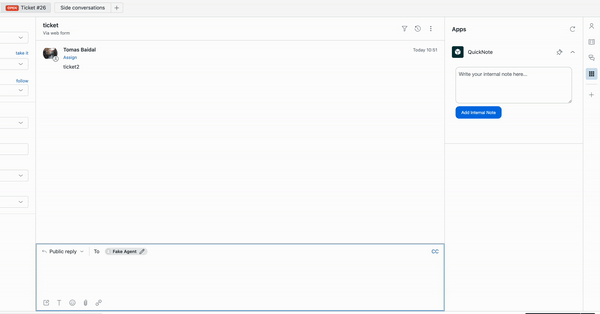

# QuickNote for Zendesk

QuickNote is a lightweight Zendesk app designed to streamline the process of adding internal notes to tickets. With a simple and intuitive interface, support agents can quickly jot down important information without navigating away from the ticket page. This documentation covers the setup, usage, and integration of QuickNote into your Zendesk environment.

## Features

- **Simple Interface**: A clean, distraction-free text area to write notes.
- **Easy Integration**: Works seamlessly within the Zendesk ticketing interface.
- **Efficiency**: Reduces the time and effort to add notes to tickets.

## Installation

1. Download the QuickNote app source code from this repository in zip format.
2. Navigate to your Zendesk Admin Center.
3. Under the **Apps and Integrations** section, find the **Manage** > **Upload private app** option.
4. Upload the downloaded source code when prompted.
5. Follow the on-screen instructions to complete the installation.

## Usage

After installation, the QuickNote app will be available on the ticket sidebar within the Zendesk interface. To use QuickNote:

1. Open any ticket in your Zendesk Support account.
2. Locate the QuickNote app on the right sidebar.
3. Type your internal note in the provided text area.
4. Click the **Add Internal Note** button to save the note to the ticket.

## Demo Video

## Customization

The app's appearance and functionality can be customized by modifying the `main.css` and `main.js` files. Ensure you have a basic understanding of HTML, CSS, JavaScript and Zendesk API to make any changes.

## Support

For support, questions, or feedback, please [create an issue](https://github.com/tbs89/zendesk_quicknote/issues/new/choose) in this repository.

## Contributing

I welcome contributions to QuickNote! If you'd like to improve the app or suggest new features, please feel free to fork the repository, make your changes, and submit a pull request.

## License

QuickNote is released under the [MIT License](LICENSE).

